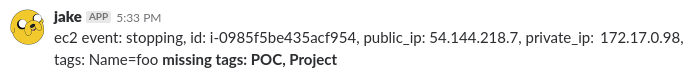

# slackers
A collection of Slack bots.

## Getting started
1. Create a virtual environment based on python3.
2. Get the python requirements: `pip install -r requirements.txt`
3. Create a slackers.cfg (see: slackers.cfg.example)

## ec2bot
ec2bot monitors an SQS queue for ec2 events. This includes any state change notification for the ec2 instances in your account. State changes are reported to the configured channel subject to the configuration parameters described below. Slack messages will look something like this:

ec2bot uses boto3, which means that you also need to configure your shell to have access to the SQS queue. That's beyond the scope of this document, but the author uses the `AWS_PROFILE` environment variable to select the correct AWS credentials.

### Configure & run ec2bot
1. Create an SQS queue (called `awsmonitor` for this example)
2. Create a new CloudWatch Rule with a source of `aws.ec2` and a target of `awsmonitor`
3. Create a Slack Bot (Workspace -> Manage Apps -> Custom Integrations -> Bots -> Add Configuration)
4. Edit slackers.cfg with your slack token, SQS queue name, and channel name.
5. Start up the bot! `python ec2bot.py slackers.cfg`

### Required tags
Nag the slack channel when instances start up that are missing this list of tags. REQUIRED_TAGS should be a comma separated list of tags that should be present on every instance.

### Ignored instances
Set the IGNORED_INSTANCE_NAME_REGEX to a regex string to ignore certain indexes.
TODO: This should be more configurable beyond a single regex and should be possible to apply to other tags and metadata (such as state change event).

## wybott
A bunch of jank that trains a markov chain generator and imitates that user on Slack.

Once propertly trained, wybott will say things like:

### Train a model
First, get some content to train on. I did this initially by pulling everything
that a particular user said publicly from our elasticsearch index and putting it
into a file, one line per sentence.

Next, train a model. I used `wybott-trainer.py` to train the model based on the file of sentences.

Finally, run the bot with that model. `python wybott.py` will use `slackers.cfg` to find your model and connect to Slack.
